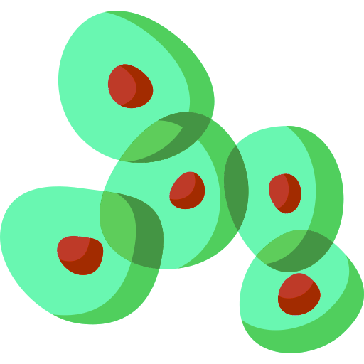
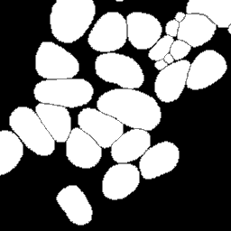
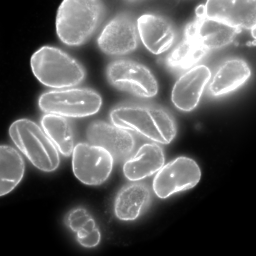
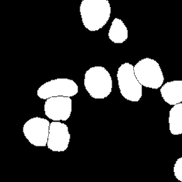
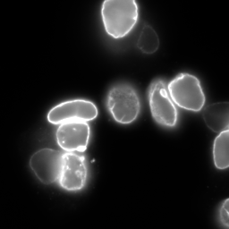

# Fluospotter



Fluospotter is an end-to-end pipeline designed for nuclei segmentation and puncta detection in fluorescence microscopy images. In short, it offers:

* **Nuclei segmentation:** Leveraging a U-Net model, Fluospotter performs 3D segmentation of nuclei, ensuring accurate delineation of their spatial boundaries.
* **Puncta detection:** Fluospotter effectively identifies puncta, even in scenarios where puncta may overlap.

As a result, Fluospotter offers researchers a powerful tool for in-depth analysis of cellular structures and dynamics in fluorescence microscopy data.

## Contents

- [Contents](#contents)
- [Overview](#overview)
- [Installation](#installation)
- [Usage](#usage)
- [Use your own data](#use-your-own-data)
- [Acknowledgements](#acknowledgements)

## Overview

In fluorescent microscopy data, detecting diffraction-limited puncta is a common task. Traditionally, these puncta are detected using mathematical operators that rely on manually set parameters from the end-user, making the process complex and tedious. Additionally, for nuclei segmentation, methods like Cellpose or other similar neural networks are commonly employed. However, these approaches can be slow and computationally expensive due to their complexity.

Fluospotter addresses these challenges by automatically finding puncta without the need for human intervention. It achieves precise and efficient puncta detection in fluorescent microscopy images by leveraging a neural network. Moreover, it utilizes a trained U-Net optimized for fast segmentation of cell nuclei.

### Segmentation model

Fluospotter uses an [nnU-Net architecture](https://www.nature.com/articles/s41592-020-01008-z), a semantic segmentation method that automatically adapts a U-Net to a given dataset. Traditionally, when faced with a new problem, a tailored solution needs to be manually designed and optimized based on several factors such as volume sizes, class ratio, voxel sizes, among others. However, this is not the case with nnU-Net, as it analyzes the provided training cases and automatically configures a matching U-Net-based segmentation pipeline. The model has been trained on data containing three distinct classes:

* Class 0 (*background*): Represents areas outside the nuclei.
* Class 1 (*border*): Captures the boundaries of the nuclei, helping to separate touching cells.
* Class 2 (*interior*): Represents the inside region of the cell nuclei.

This multi-class segmentation approach allows Fluospotter to accurately delineate the spatial structure of cell nuclei, even in challenging scenarios where cells are closely packed or overlapping. It also enables segmentation with an unknown number of cells, which can later be utilized for instance segmentation.

<table style="border: none; border-collapse: collapse; width: 100%;" align="center">
  <tr>
    <td style="padding-right: 20px; border: none; text-align: center;">
      
      <br>
      <p style="margin: 5px 0;">Annotation example 1</p>
    </td>
    <td style="padding-right: 20px; border: none; text-align: center;">
      
      <br>
      <p style="margin: 5px 0;">Data example 1</p>
    </td>
    <td style="padding-right: 20px; border: none; text-align: center;">
      
      <br>
      <p style="margin: 5px 0;">Annotation example 2</p>
    </td>
    <td style="border: none; text-align: center;">
      
      <br>
      <p style="margin: 5px 0;">Data example 2</p>
    </td>
  </tr>
</table>

For instance segmentation, connected component labels are assigned to the regions classified as class 2 (interior) to identify and distinguish individual cells.

Segmentation is performed using a moving window approach to handle the data in smaller chunks, as processing the entire volume at once would be computationally expensive in terms of memory.

## Installation

This package is built for Python versions newer than 3.6 and can easily be installed with pip:

``pip install fluospotter``

Or using:

``pip install https://github.com/arnaublanco/Fluospotter.git``

Additionally for GPU support, install torch-gpu through pip and with the appropriate CUDA and cuDNN versions matching your GPU setup.

## Usage

```python
from fluospotter.models import SegmentationModel
from fluospotter.datasets import Dataset

data = Dataset(data_dir="testing_data")

cfg = {
    "patch_size": "48/256/256",
    "im_size": "105/2014/1024",
    "instance_seg": "True"
}

model = SegmentationModel(model_name="dynunet", configuration=cfg, pretrained="model.pth", refinement="refinement.pth")
prediction = model.predict(data)
```

## Use your own data

To annotate the data, [WebKnossos](https://webknossos.org) was employed. It uses AI to automatically detect cells within a bounding box specified by you across each slice, simplifying the annotation process. If the automatic detection is not accurate, the annotations can be easily corrected. While there is an online platform for uploading your data, you can also run WebKnossos locally if you prefer not to share your data.

To use WebKnossos locally, first download `docker-compose.yml` using the PowerShell on Windows:

```
Invoke-WebRequest -Uri "https://github.com/scalableminds/webknossos/raw/master/tools/hosting/docker-compose.yml" -OutFile "docker-compose.yml"
```

On Linux:

```
curl -o docker-compose.yml https://github.com/scalableminds/webknossos/raw/master/tools/hosting/docker-compose.yml
```

Next, run [Docker](https://www.docker.com/) and open the command line with administrator privileges and run WebKnossos:

```
docker-compose up -d
```

Now you should be able to access WebKnossos in your web browser at `http://localhost:9000` to load and annotate your files. To stop the Docker, just type `docker-compose down`.


The [repository](https://github.com/scalableminds/webknossos) contains a detailed `README.md` and additional documentation for more specific configurations and troubleshooting.

## Acknowledgements

This Python library is the result of my Master's thesis titled <i>"Fluospotter: an end-to-end pipeline for
nuclei segmentation and puncta detection
in fluorescence microscopy"</i>, from the Computational Biomedical Engineering master's degree at Universitat Pompeu Fabra in Barcelona, Spain. I would like to thank my supervisors David Castillo and Adrián Galdrán (@agaldran), and the Acuity Spatial Genomics team to make this possible.

## License

This project is licensed under the CC0 1.0 Universal (CC0 1.0) Public Domain Dedication. See the [LICENSE](LICENSE) file for details.
