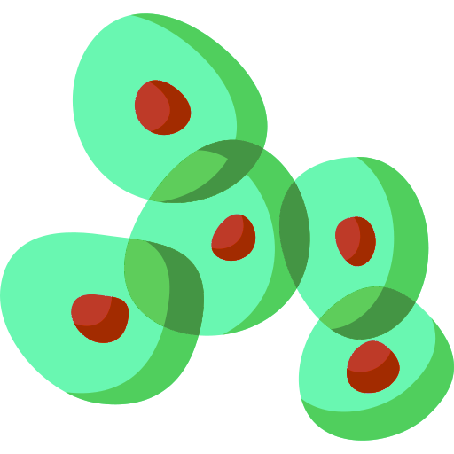

# Fluospotter



Fluospotter is an end-to-end pipeline designed for nuclei segmentation and puncta detection in fluorescence microscopy images. In short, it offers:

* **Nuclei segmentation:** Leveraging a U-Net model, Fluospotter performs 3D segmentation of nuclei, ensuring accurate delineation of their spatial boundaries.
* **Puncta detection:** Fluospotter effectively identifies puncta, even in scenarios where puncta may overlap.

As a result, Fluospotter offers researchers a powerful tool for in-depth analysis of cellular structures and dynamics in fluorescence microscopy data.

## Contents

- [Contents](#contents)
- [Overview](#overview)
- [Documentation](#documentation)
- [Installation](#installation)
- [Usage](#usage)
- [Acknowledgements](#acknowledgements)

## Overview

In fluorescent microscopy data, detecting diffraction-limited puncta is a common task. Traditionally, these puncta are detected using mathematical operators that rely on manually set parameters from the end-user, making the process complex and tedious. Additionally, for nuclei segmentation, methods like Cellpose or other similar neural networks are commonly employed. However, these approaches can be slow and computationally expensive due to their complexity.

Fluospotter addresses these challenges by automatically finding puncta without the need for human intervention. It achieves precise and efficient puncta detection in fluorescent microscopy images by leveraging a neural network. Moreover, it utilizes a trained U-Net optimized for fast segmentation of cell nuclei.

## Documentation

More documentation about fluospotter including how to train, create a dataset, etc. will be provided soon.

## Installation

This package is built for Python versions newer than 3.6 and can easily be installed with pip:

``pip install fluospotter``

Or using:

``pip install https://github.com/arnaublanco/Fluospotter.git``

Additionally for GPU support, install torch-gpu through pip and with the appropriate CUDA and cuDNN versions matching your GPU setup.

## Usage

```python
from fluospotter.models import SegmentationModel
from fluospotter.datasets import Dataset

data = Dataset(data_dir="testing_data")

cfg = {
    "patch_size": "48/256/256",
    "n_classes": "3",
    "im_size": "48/512/512",
    "instance_seg": "True",
    "refinement": "True"
}

model = SegmentationModel(model_name="dynunet", configuration=cfg, pretrained="model.pth", refinement="refinement.pth")
prediction = model.predict(data)
```

## Acknowledgements

This Python library is the result of my Master's thesis titled <i>"Fluospotter: an end-to-end pipeline for
nuclei segmentation and puncta detection
in fluorescence microscopy"</i>, from the Computational Biomedical Engineering master's degree at Universitat Pompeu Fabra in Barcelona, Spain. I would like to thank my supervisors David Castillo and Adrián Galdrán (@agaldran), and the Acuity Spatial Genomics team to make this possible.

## License

This project is licensed under the CC0 1.0 Universal (CC0 1.0) Public Domain Dedication. See the [LICENSE](LICENSE) file for details.
